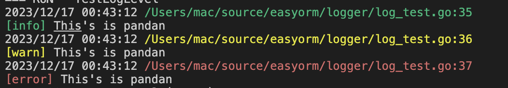

# Golang实现自己的orm

本项目相当于gorm的精简版，通过学习本项目可以更好的理解orm框架每个函数都在做什么，以及为什么这么定义框架功能。

通过本项目学到什么？

- 定义自己的日志库logger
- 如何将结构体转化成数据库的表信息（字段/字段类型/表名）
- 如何实现常用的CRUD？
- 如何实现事物？
- 如何实现钩子？


## 代码简介

该项目的核心数据结构为 `Session`

```go

type Session struct {
	db *sql.DB
	tx *sql.Tx

	// table
	tableMeta *table.TableMeta

	dial dialect.Dialect
	// clause

	clause clause.Clause

	// sql query
	sql strings.Builder
	// sql param
	sqlParam []interface{}
}

```

- db: 负责执行sql语句
- tx: 通过事物执行sql语句
- tableMeta： Golang的结构体转成的 表信息
- clause: sql语句构造器（负责生成CRUD SQL 字符串 ）
- dial: 将Golang数据类型转成 数据库的类型
- sql/sqlParam： 待执行的sql和参数

**定义自己的日志库logger**

特色：就是不同的日志级别有不同的颜色


**如何将结构体转化成数据库的表信息（字段/字段类型/表名）**

```go

// Parse 将结构体转化成 表/字段/字段类型
func Parse(dest interface{}, d dialect.Dialect) *TableMeta {
	// 是否为nil
	if dest == nil {
		return nil
	}

	// (*User)(nil)
	value := reflect.ValueOf(dest)
	if value.Kind() == reflect.Ptr && value.IsNil() {
		value = reflect.New(value.Type().Elem()) // 取出类型，构造新对象
	}

	meta := &TableMeta{
		Model:    value.Interface(), // 保存对象
		fieldMap: make(map[string]*Field),
	}

	destValue := reflect.Indirect(value)
	destType := destValue.Type()

	// 结构体类型名：就是表名
	m, ok := value.Interface().(Tabler)
	if ok {
		meta.TableName = m.TableName()
	} else {
		meta.TableName = destType.Name()
	}

	for i := 0; i < destType.NumField(); i++ {

		fieldType := destType.Field(i)

		// 非匿名 && 可导出
		if !fieldType.Anonymous && fieldType.IsExported() {
			// 成员变量：就是字段名
			// 成员变量类型：就是字段类型
			field := &Field{
				FieldName: fieldType.Name,
				FieldType: d.ConvertType2DBType(destValue.Field(i)),
				FieldTag:  fieldType.Tag.Get("easyorm"),
			}

			meta.Fields = append(meta.Fields, field)
			meta.FieldsName = append(meta.FieldsName, field.FieldName)
			meta.fieldMap[field.FieldName] = field
		}
	}

	return meta
}

```

**如何实现常用的CRUD**

这里以新增为例：一般的调用方式为 `s.Insert(&User{},&User{})`

整个代码其实就是基于传入的values，通过 `reflect`的相关函数提取出其中的字段值，最终的目的在于拼接成 `insert into $table ($field) values (?,?),(?,?) ` 标准的SQL语句，传给底层的驱动执行
```go
// s.Insert(&User{},&User{})
func (s *Session) Insert(values ...interface{}) (int64, error) {
	if len(values) == 0 {
		return 0, errors.New("param is empty")
	}
	// init table
	s.Model(values[0])
	// clause insert：负责生成 insert into $tableName ($FieldName) 字符串
	s.clause.Set(clause.INSERT, s.TableMeta().TableName, s.TableMeta().FieldsName)

	valueSlice := []interface{}{}

	for _, value := range values {
		s.CallMethod(BeforeInsert, value)
        // 提取结构体中对象字段的值，作为sql语言的参数
		valueSlice = append(valueSlice, s.TableMeta().ExtractFieldValue(value))
	}
	// clause values：负责生成 values (?,?,?),(?,?,?)
	s.clause.Set(clause.VALUES, valueSlice...)
    //s.clause.Build: 负责将 insert into $tableName ($FieldName)  拼接上 values (?,?,?),(?,?,?) 形成完整的sql语句
	sql, sqlParam := s.clause.Build(clause.INSERT, clause.VALUES)
	// exec sql ： 实际执行sql
	result, err := s.Raw(sql, sqlParam...).Exec()
	if err != nil {
		return 0, err
	}
	s.CallMethod(AfterInsert, nil)
	return result.RowsAffected()
}

```

**如何实现事物？**

通过`Session`的`Begin`方法开启事物，在回调函数 `f TxFunc`中进行具体的【数据库业务逻辑】，最后基于  `f TxFunc`是否执行返回 `error`来决定是`Commit`还是 `Rollback`

```go

// TxFunc will be called between tx.Begin() and tx.Commit()
type TxFunc func(*session.Session) (interface{}, error)

// Transaction executes sql wrapped in a transaction, then automatically commit if no error occurs
func (engine *Engine) Transaction(f TxFunc) (result interface{}, err error) {
	s := engine.NewSession()
	if err := s.Begin(); err != nil {
		return nil, err
	}
	defer func() {
		if p := recover(); p != nil {
			_ = s.Rollback()
			panic(p) // re-throw panic after Rollback
		} else if err != nil {
			_ = s.Rollback() // err is non-nil; don't change it
		} else {
			err = s.Commit() // err is nil; if Commit returns error update err
		}
	}()

	return f(s)
}
```


**如何实现钩子？**
其实就是利用`reflect.MethodByName`，读取 value 对象的函数，然后`Call`执行该函数，本质就是回调。利用钩子在获取到数据以后，用户可以在回调中对数据进行统一修改，对执行结果进行收口
```go
// CallMethod calls the registered hooks
func (s *Session) CallMethod(method string, value interface{}) {
	fm := reflect.ValueOf(s.TableMeta().Model).MethodByName(method)
	if value != nil {
		fm = reflect.ValueOf(value).MethodByName(method)
	}
	param := []reflect.Value{reflect.ValueOf(s)}
	if fm.IsValid() {
		if v := fm.Call(param); len(v) > 0 {
			if err, ok := v[0].Interface().(error); ok {
				logger.Error(err)
			}
		}
	}
}

```


Ps: 本项目主要参考极客兔兔 geeorm